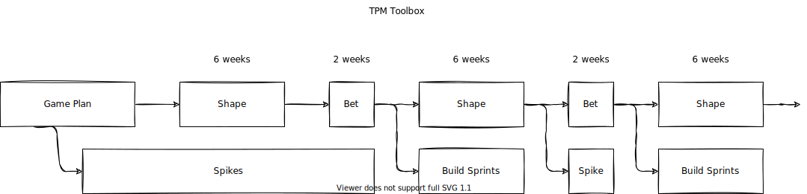

# tpm-toolbox

## Introduction

This repository describes a proposal process for a project delivery.

After delivering a number of engagements, and studying about different approaches,
I compiled a proposal that unites what is best, IMHO, from each one and created
this document.

It's basically the Shape Up toolbox, with added process from the CSE Code With PlayBook
and Agile.

It's not, in any means, finished and polished to be directly applied anywhere, but
may give some light on how to improve the felling that the project is evolving and
providing value to the customer.

Further documentation you may want to read:

[Code With Engineering PlayBook](https://microsoft.github.io/code-with-engineering-playbook/)  
[Agile](https://agilemanifesto.org/)  
[Shape Up](https://basecamp.com/shapeup)  

## The TPM Toolbox

Here's where I started mixing everything, and creating a foundation about how one
could deliver an engagement where we have well defined goals and not only sprints
that will, eventually, deliver what was requested by the customer in the first place.

The boxes can be described as:

- Game Plan: create a high level architecture and design, including technologies,
  languages and products to complete engagement objective
- Shape: from the game plan break the work to be done in the build sprints.
- Bet: decide what will be built
- Spike: based on what is being planned to be delivered, prepare the team to use
  the tech - cloud services, programming language, data bases, infrastructure, etc..
- Build Sprints: time for the team to implement what was defined in the shape phase
- Refresh: review what's delivered and prepare for the next build sprint

Teams:

- Customer: is any individual - person, area, organization - that has a need that
  would be solved when we deliver this solution
- TPM: or Technical Project Manager, is the person responsible for the communication
  with the customer and the dev crew. The TPM will challenge the Dev Lead with questions
  about the solution the dev crew will build
- Dev Lead: a Senior developer acting as the technical advocate during the shape,
  its position is not to be the manager of the team, but a peer that the team have
  confidence and are open to discuss the different approaches
- SME: or Subject Matter Expert, is the person that has deep knowledge in a given
  technology that will help the dev crew unblock the issues we are facing

The matrix below provides a view where each role applies:

| Phase | Customer | TPM | Dev Lead | Dev | SME |
| --- | --- | --- | --- | --- | --- |
| Game Plan | P | F | F | F | S |
| Shape | P | F | F | | S |
| Bet | F | F | F | F | |
| Build Sprints | | S | S | F | S |
| Refresh | | | | F | |

> **F**: Full time  
> **P**: Part time  
> **S**: Support  

## The proposal

Each part is well defined in their respective documentation, so I'm focusing more
on how I would use it in an engagement.

The initiator is the customer, that comes with a `request`. We analyze the `request`
and create a `Game Plan` from it. The development of the `Game Plan` would take
some time, but as we refine it we know the high level architecture, the technology,
the infrastructure we would need to support the solution, the programing language,
the database, and so on. So the dev crew can start their `spikes`, where we will
go deeper in the area we will focus in the project, but learning and experimenting
with the technology.

By the time the `Game Plan` is approved, and while the dev crew are doing the `spikes`,
the TPM, the Dev Lead and the customer, start thinking about what we want to deliver.
From the `Game Plan` we have a macro view of the engagement until the final product
is delivered, but what's in between? So we start to `Shape` the project.

***"Shaping is creative and integrative. It requires combining interface ideas with
technical possibilities with business priorities."***

We will **not** review the architecture and we will **not** define how the team will
deliver. we will **not** create mockups, as this may lead to biased opinions. It's
about going deeper on what we have in the `Game Plan`, but it's not the final definition.
We will start breaking the project, describing the problem and outlining a solution,
reviewing the risks, and discussing *why* we want that part implemented. Also, remember
we can build-up the pieces of the solution, so we don't need to build everything
just yet. We have a "time-boxed" build phase, remember?

With the `shape` complete, when we are able to answer the *why's* to ourselves,
we will start the `bet`. In the `bet` phase we will agree on what we will deliver.
This involves the customer, as the most interested party, but the dev crews as well.
The team will discuss and give weights on what is to be delivered, not based on
effort we will spend, but the value added to the final solution. We also invite
the dev crew so we can have the ideas clear to everyone. If we feel one idea isn't
clear, and need more discussion, this is the time.

It's possible that not all the ideas proposed in the `shape` phase are accepted,
or pass the `bet` phase, there is always a possibility we propose that idea again,
if we refine and re-shape it, unless we find the idea not to be really important,
and we could move on to other.

***"...ideas are cheap. They come up all the time and accumulate into big piles.
Really important ideas will come back to you."***

Now we defined what we will build, we enter the `build sprints` phase. This is when
the dev crew will self organize to deliver what was agreed. In the Engineering PlayBook
we have a definition of a [sprint structure](https://microsoft.github.io/code-with-engineering-playbook/SPRINT-STRUCTURE/).
If we use only this, we can spend a long time planing and a short time coding -
just think about working with teams spread over different timezones and we *waste*
some ours waiting on others to wake up after a well deserved night of sleep. So,
using a longer time box we can, proportionally, give more time to code. We'll have
the tasks written in the board, and we have the daily scrum so we can check on each
other, but that won't take long. And we will focus on what really matters in the
end.

Notice that we won't have the sprint planning, as this was done in the `bet` phase,
nor we have a backlog refinement, as there is no backlog. There is only pure tasks
to deliver what was decided in the `bet` phase. When we finish the `build sprints`
we will have delivered value to the solution.

When we completed the `build sprints` phase we restart the circle, with a `refresh`
phase that will work as a slow down period, when the team can prepare for the next
phase.

In this process we tried to be as inclusive as possible, giving voice to every participant
of the engagement, at the same time that we allowed them to focus where they provide
the most value, being in the definition of the scope, being in the creation of the
solution, but we participate in the end-to-end. Creating the blocks that we will
stack until we have the final solution implemented.
